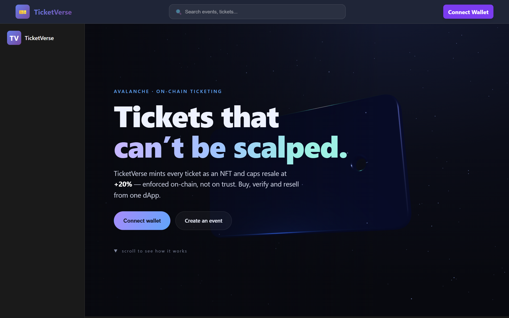
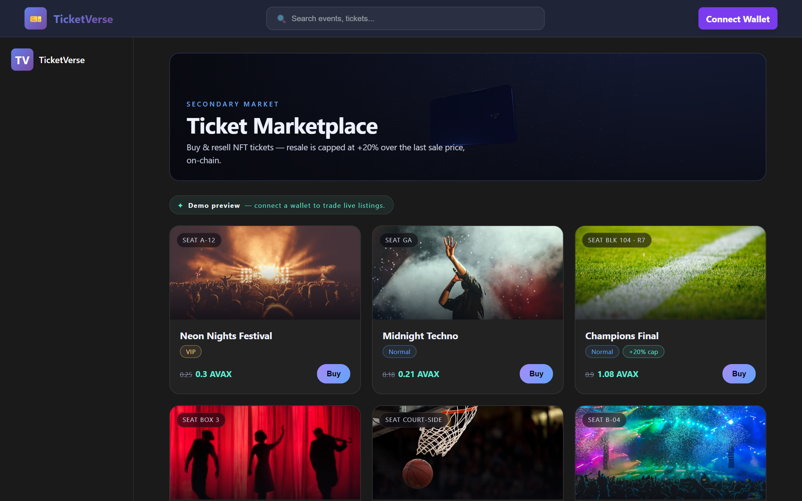
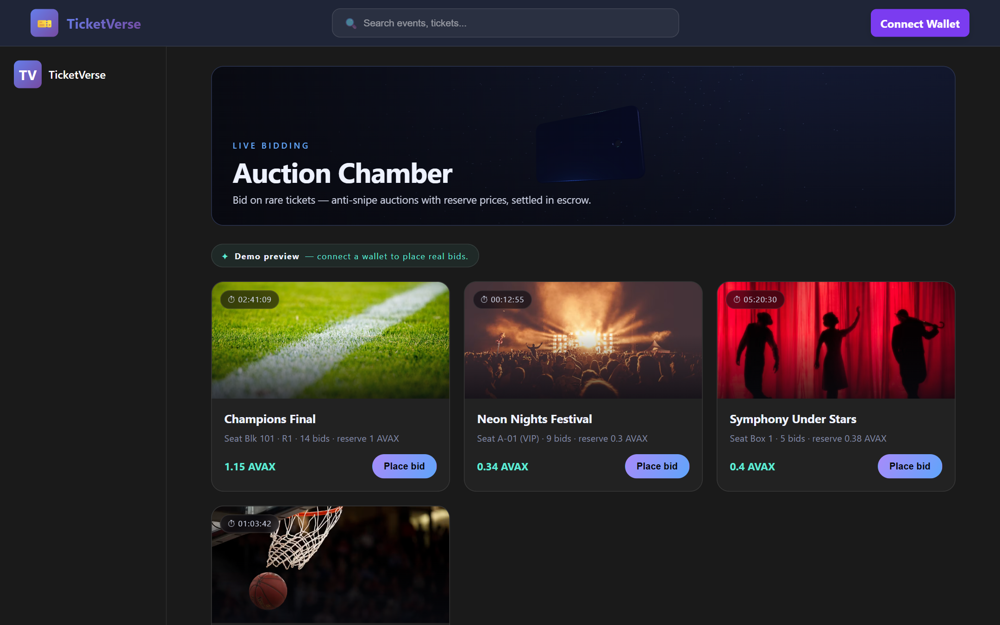
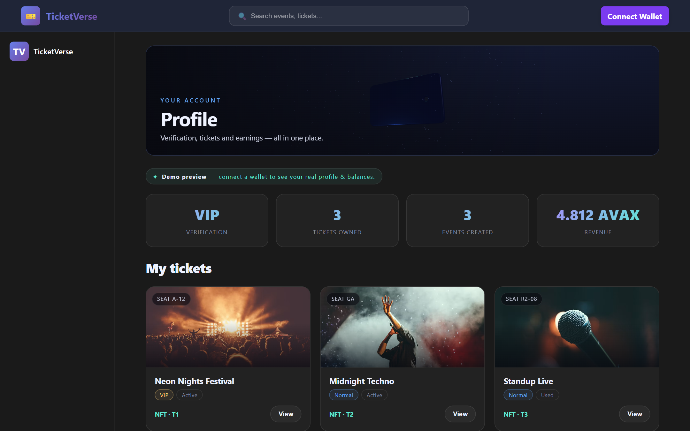
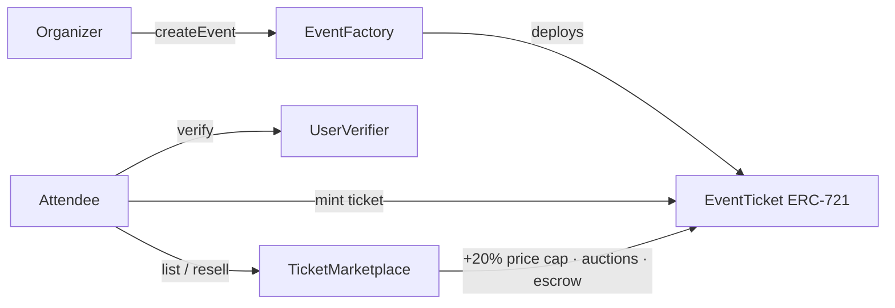

<div align="center">

# 🎟️ TicketVerse

### NFT ticketing on Avalanche — with anti-scalping built into the chain

[](https://mr-bathwal.github.io/Avalanche-Hacking/)
&nbsp;


</div>

> Built at the **Avalanche × Draper Startup House Hackathon**. TicketVerse turns event
> tickets into NFTs so they can't be duplicated or forged — and enforces **fair-resale
> rules on-chain** so scalpers can't mark them up. Buy, verify, and resell tickets
> from one dApp.

**🔗 Live demo:** https://mr-bathwal.github.io/Avalanche-Hacking/
*(read-only browsing works out of the box; buying/reselling needs a wallet on Avalanche Fuji testnet)*

---

## ✨ Highlights

- 🎫 **Tickets are NFTs** — each ticket is an ERC-721 with a seat number, tier (VIP / normal), and venue baked in. Impossible to duplicate or counterfeit.
- 🛡️ **Anti-scalping resale** — the marketplace caps resale at **+20% over the last sale price**, enforced in the contract, not just the UI.
- 🧑‍⚖️ **On-chain human verification** — a `UserVerifier` contract gates sensitive actions behind a verification level, deterring bots and bulk-buying.
- 🔨 **Fixed-price & auction resale** — list at a set price or run a timed auction with reserve price, min-bid increments, and anti-snipe extensions.
- 💰 **Deposit-based settlement** — buyers deposit into an event escrow; purchases and bids settle against balances for safer, gas-efficient trades.
- 📍 **Discover nearby events** — optional geolocation surfaces events happening around you.
- 🎨 **Polished React UI** — RainbowKit wallet flows, responsive layout, skeleton loading, and toast feedback.

---

## 🖼️ Screenshots

> Live captures of the deployed app. A **WebGL 3D ticket** hero, and a full
> **demo mode** (mock data) so you can browse the whole flow with no wallet.

| Landing — WebGL 3D ticket hero | Marketplace — demo mode |
|:--:|:--:|
|  |  |
| **Auction Chamber — demo mode** | **Profile — demo mode** |
|  |  |

---

## 🏗️ How it works



1. **Organizers** call `EventFactory.createEvent(...)`, which deploys a dedicated **`EventTicket`** (ERC-721) contract for that event.
2. **Attendees** get verified through **`UserVerifier`**, then mint a ticket NFT for a chosen seat (VIP seats are priced and time-locked separately).
3. **Resale** goes through **`TicketMarketplace`** — either a fixed-price listing or a timed auction — with the **+20% anti-inflation cap** and deposit-based settlement enforced on-chain.

---

## 🧰 Tech stack

| Layer | Tech |
|--|--|
| **Chain** | Avalanche Fuji C-Chain · Solidity smart contracts |
| **Web3** | wagmi v2 · viem · ethers v6 · RainbowKit |
| **Frontend** | React 19 · React Router v7 · Vite 7 · Tailwind CSS v4 |
| **Storage** | IPFS via Pinata (ticket metadata) |
| **UX** | sonner (toasts) · geolocation · human-verification challenge |

---

## 📜 Deployed contracts (Fuji testnet)

| Contract | Address |
|--|--|
| UserVerifier | [`0xD8d2…E943`](https://testnet.snowtrace.io/address/0xD8d2412e32cB638CCBdD297F75eC091f09d9E943) |
| EventFactory | [`0xBdfD…edBe`](https://testnet.snowtrace.io/address/0xBdfD55f12efCBd84Fc5851b7e9E1931b5381edBe) |
| TicketMarketplace | [`0x4C64…dED7`](https://testnet.snowtrace.io/address/0x4C64044450e5f5F05Bbb5c462DBc3d32B7c1dED7) |

**Contract source + tests:** [`smart-contracts/`](smart-contracts/) — Hardhat + OpenZeppelin v5, with a passing test suite covering minting, the anti-scalping cap, and royalty settlement. Redeploy with `npm run deploy:fuji` and paste the new addresses into `src/lib/contracts.js`.

---

## 🚀 Getting started

**Prerequisites:** Node.js 18+, and a wallet (e.g. MetaMask/Core) on the **Avalanche Fuji** testnet with test AVAX from the [faucet](https://faucet.avax.network/).

```bash
git clone https://github.com/Mr-Bathwal/Avalanche-Hacking.git
cd Avalanche-Hacking
npm install
cp .env.example .env   # optional — sensible public defaults are built in
npm run dev            # http://localhost:5173
```

```bash
npm run build          # production build → dist/
npm run preview        # preview the production build
npm run lint           # eslint (currently clean)
```

Configuration is read from environment variables (see [`.env.example`](.env.example)); no secrets live in the source.

---

## 📂 Project structure

```
src/
├── pages/          # Home, EventDetails, BookSeat, BuyNFT
├── components/     # Marketplace, AuctionChamber, CreateEvent, Profile, Nearby…
├── lib/            # wagmi config + contract addresses/ABIs
├── hooks/          # useGeolocation, useHumanVerification
├── utils/          # ethereum/web3 helpers, Pinata/IPFS, sample assets
└── abifiles/       # contract ABIs (JSON)
```

---

## 🗺️ Roadmap

- [x] Solidity contract sources + tests — see [`smart-contracts/`](smart-contracts/)
- [x] Secondary-royalty split to organizers on every resale
- [ ] Move ticket images fully on-chain / to a dedicated IPFS gateway
- [ ] Mainnet (Avalanche C-Chain) deployment

---

## 📄 License

MIT © [Gourav Bathwal](https://github.com/Mr-Bathwal)
